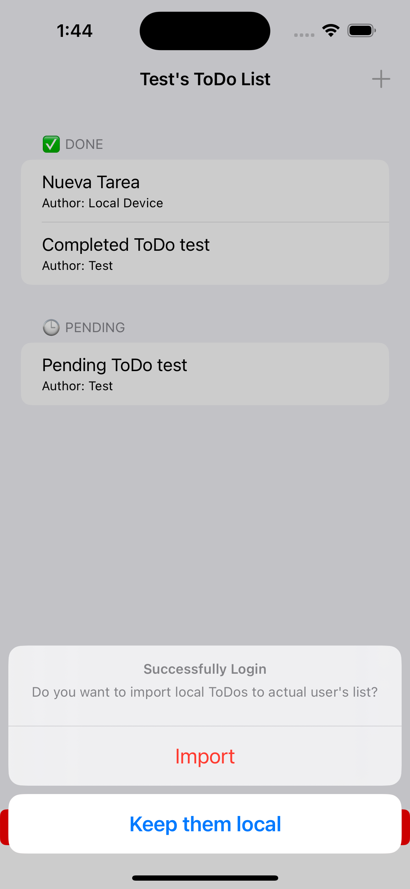

# ToDo App
*Por: Brian Jiménez Moedano*

*Marzo 2023*

## Descripción

**ToDo App** ha sido, a la fecha en que escribo esto, un **gran logro en mi carrera como desarrollador iOS**, al ser mi primera aplicación que incorpora **servicios de almacenamiento y sincronización en la nube** a través de **MongoDB Atlas** y el **SDK de Realm para Swift**. La **motivación** de este proyecto fue la de **entender, aplicar y como resultado madurar los conceptos de persistencia de datos locales, remotos y la sincronización de ambos**; con miras a desarrollar posteriormente aplicaciones más complejas utilizando estos principios y tecnologías. Los **objetivos fueron crear una aplicación básica** en el mundo del desarrollo de software como lo es una **App de ToDos, con la característica de poder sincronizar ToDos de manera local y remota por medio de un servicio en la nube, apoyandome a su vez de un servicio de autenticación de usuarios**, creando así una **experiencia más personalizada y útil** al usuario.

## Características

- **Aplicación utilitaria** para gestionar **ToDos.**
- Persistencia de datos locales y sincronización con Base de Datos remota con **SDK de Realm para Swift** para los ToDos y **UserDefaults** para el nombre de usuario.
- Servicio de almacenamiento en la nube, autenticación de usuarios (user - password) y administración de Base de Datos con **MongoDB Atlas.**
- Permite crear ToDos **locales** y/o **asociados a una cuenta de usuario.**
- Permite **importar ToDos locales a una cuenta de usuario para su persistencia en la nube.**
- Permite **conservar ToDos asociados a una cuenta de usuario como copias locales en el dispositivo.**
- Permite trabajar en modo **"OffLine"** con los ToDos asociados a una cuenta de usuario, los cuales se **sincronizan con la Base de Datos remota una vez se conecta a Internet el dispositivo.**
- Manejo de **funciones y tareas asíncronas (concurrencia).**
- Implementa patrones de diseño **Observable** y **Delegamiento**.
- **Interfaz de usuario creada programáticamente.**
- Uso de **UITableViewDiffableDataSource** para una mejor experiencia de usuario al visualizar y manejar los ToDos.

## Cómo Utilizarla

Al abrir la aplicación, se presentarán tres opciones al usuario:

1. **Agregar Todo:** Presionar el botón de **"+"** situado en la esquina superior derecha de la pantalla, **crea un nuevo ToDo por defecto, con un nombre genérico y un estatus de pendiente.**

    
2. **Presionar sobre el ToDo:** abre la ventana de edición del ToDo seleccionado, en donde el usuario puede editar la **tarea** y el **estado** del ToDo. En esta ventana también podremos visualizar al **autor** del ToDo; si se creó con una sesión de usuario abierta tendrá el nombre de éste, de lo contrario, aparecerá como **"Local Device"** indicando que se trata de un ToDo administrado únicamente por la Base de Datos local.

    
3. **Login/SignUp:** Presionar el botón abrirá la pantalla de **inicio de sesión/registro de usuarios.**

Al ser una pantalla compartida, el usuario debe ingrear su **nombre de usuario** y una **contraseña válida (de por lo menos 6 y hasta 128 caractéres)**. Si el usuario **ya existe registrado** en la base de datos del servicio de almacenamiento en la nube, la App **iniciará una sesión y cerrará la ventana**, de lo contrario, **indicará que dicho usuario no se encuentra registrado, y dará la opción de registrarlo.**

**Puede probar la App con las siguiente credenciales de prueba:**
- **User Name: Test**
- **Password: test21**

Una vez iniciada la sesión, la App **descargará los ToDos del usuario en el dispositivo local**, de la misma manera, **actualizará los ToDos del usuario que hayan quedado copiados localmente** en caso de haberlos. Finalmente **identificará si hay ToDos locales y le dará la posibilidad al usuario de importar dichos ToDos a la base de datos remota con el usario actual como autor de los mismos.**

A partir de este momento, la App se encuentra **sincronizada con la base de datos remota** para agregar, actualizar y/o eliminar los ToDos del usuario. De la misma manera, el usario podrá administrar sus ToDos **incluso si llegara a perder conexión a Internet**, ya que dichos cambios se quedarán almacenados en la base de datos locales y se sincronizarán **automáticamente** con la base de datos remota una vez que se haya reestablecido la conexión a Internet; esto último **NO** ocurrira si la App se **inicializa sin conexión a Internet**, ya que esto impide la sincronización a priori con la base de datos remota, en este caso, **los cambios efectuados en los ToDos del usuario serán sustituidos con la última información disponible en la nube, una vez que se reestablezca la conexión a Internet.** Finalmente el usuario podrá seguir administrando también sus ToDos locales (si los tuviese) sin ningún tipo de conflicto entre éstos y los ToDos del usario.

La sesión de usuario se **mantendrá activa incluso si se cierra la aplicación**, y solamente se cerrará cuando el usuario presione el botón de **logout**. Una vez cerrada la sesión, la App dará al usuario la posibilidad de **limpiar** su banjeda de los ToDos del usario que acaba de cerrar sesión, o de **mantenerlos en el dispositivo local como copias**, las cuales podrán ser administradas de manera local, **con la reserva de que estos serán sustituidos con la última información disponible una vez se inicie sesión del usario autor de los ToDos, siempre y cuando estos ToDos sigan existiendo en la base de datos remota.**

## Tecnologías/Frameworks

- **UIKit:** Para el diseño de la interfaz de usuario.
- **RealmSwift:** Para la persistencia de datos locales (toDos) en una DB, observabilidad de los objetos insertos en la DB local y sincronización con los servicios en la nube de MongoDB Atlas.
- **MondgoDB Atlas:** Para el servicio de almacenamiento en la nube, autenticación de usuarios y manejo de DB remota.
- **UserDefaults:** Para la persistencia de datos locales (nombre de usuario).
- **async/await y completionHandlers:** Para el manejo de funciones y rutinas asíncronas.
- **Delegamiento (Protocolos) e Inyección de Dependencia:** Para la comunicación entre vistas.

## Licenciamiento

- **GNU GPLv3**
